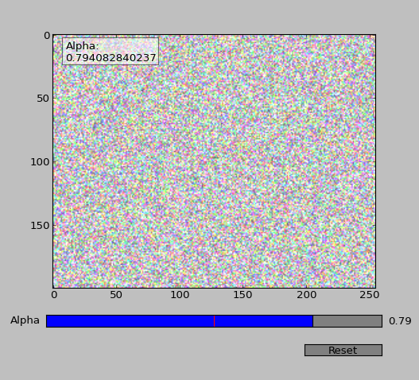
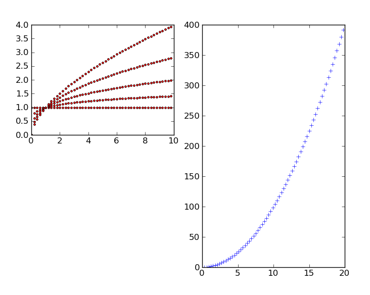

# Responsive GUI reference for Matplotlib

This script gives a short overview of how one goes about crafting a
responsive GUI using Matplotlib's GUI primitives:

It also demonstrates the placement of multi-plots and saving to image
files:

## Usage

        ./basics
